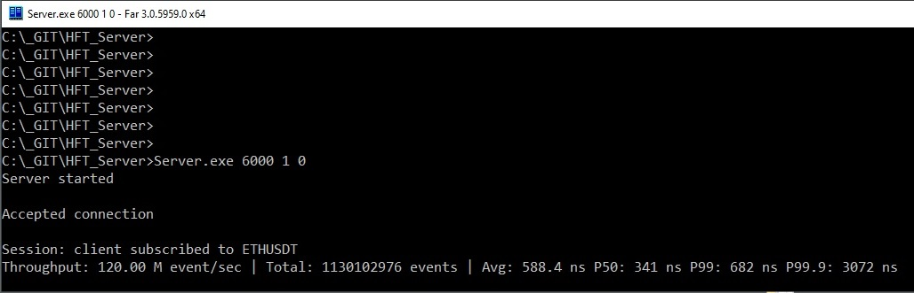
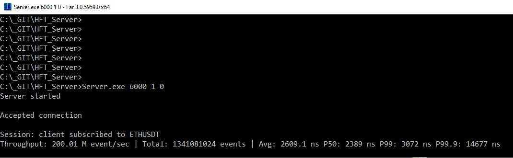
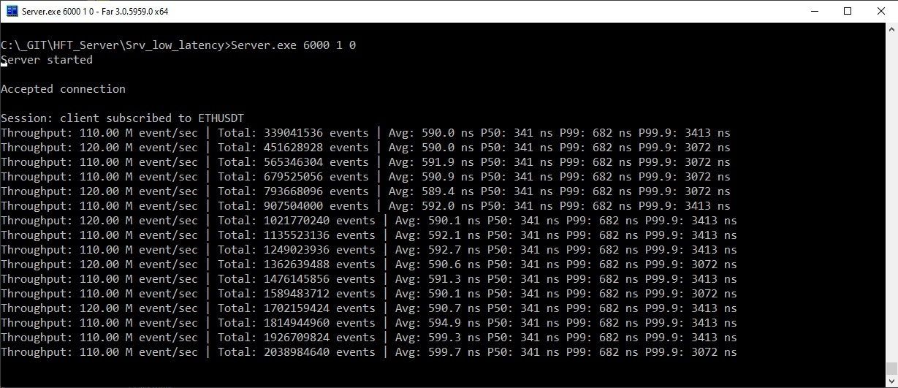
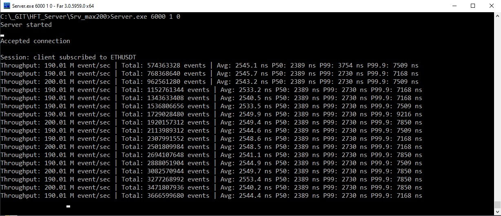

# High-Frequency Market Data Analytics Engine

A high-performance cross-platform C++ server designed for real-time monitoring and analysis of "whale" trades (large-volume transactions) on cryptocurrency exchanges. The system is engineered for low-latency data processing, utilizing lock-free structures and asynchronous I/O to handle high-throughput market data feeds.
The system performs real-time VWAP calculations and whale detection at 100M+ Events Per Second (EPS).

The engine supports two distinct data sources tailored for different use cases:

* Hi-Speed Emulation Mode: A synthetic market event generator designed for stress testing. It enables the evaluation of system throughput and latency under extreme loads (exceeding 100 million events per second) without being bottlenecked by network bandwidth.

* Production Binance Stream: A direct connection to the Binance WebSocket API. It utilizes the ixwebsocket library for a robust, high-uptime connection and SIMDJson for ultra-fast parsing of incoming JSON packets, significantly minimizing CPU overhead.


## Key Architectural Decisions & Low-Latency Trade-offs

1. **Lock-Free Concurrency Model**: Utilizes a single-producer/single-consumer (SPSC) ring buffer architecture to eliminate mutex contention. Synchronization is managed via `std::atomic` with explicit `memory_order_acquire/release` semantics to minimize pipeline stalls.

2. **Cache-Line Alignment & False Sharing Mitigation**: Critical data structures are aligned to 64-byte boundaries to prevent cache-line bouncing and L1/L2 thrashing during high-concurrency access.

3. **In-place SIMD Parsing**: To eliminate the "Copy-Per-Message" bottleneck, the system utilizes `simdjson` for zero-copy parsing. Incoming WebSocket frames are processed directly in the ingestion buffer, reducing pressure on the Allocator and TLB.

4. **Deterministic Hot Path**: The "Hot Dispatcher" is designed with a branch-predictor-friendly loop and pre-allocated metadata (CoinRegistry). This ensures that the Median (P50) latency remains under 350ns during standard production loads.

5. **Throughput vs. Latency Profiling**:
     - **Ultra-Low Latency Mode**: Configured for <1µs P99 latency. Ideal for immediate execution/reaction.
     - **High-Throughput Mode**: Capable of saturating 10GbE+ links (200M EPS). Utilizes micro-batching and polling to maximize bandwidth at the cost of slight queuing delays (~2.5µs).
	 
6. **Analytics Engine**: Calculates multiple versions of the Volume Weighted Average Price (VWAP):
     - Session VWAP: Cumulative average since server start.
     - Rolling VWAP: Moving average over the last N trades.	 

7. **Fast Metadata Lookup**: Uses a custom CoinRegistry (a high-speed hash table with open addressing) to map ticker symbols to internal indices in O(1) time.

8. **Network Core**: Powered by my personal **Client/Server boilerplate** based on Boost.Asio https://github.com/Schwarz77/AsyncTcpSignalServer


## System Architecture

The server operates as a multi-stage pipeline to ensure that network I/O never blocks the analytical engine:

* Producer (Binance/Emulator): Connects to the exchange via WebSockets and pushes raw MarketEvent data into the m_hot_buffer.

* Hot Dispatcher: Consumes raw events, updates the analytical state (VWAP, price updates) in the CoinAnalytics array.

* Event Dispatcher: Identifies "Whale Events" based on volume. If a trade exceeds the threshold, it is moved to the m_event_buffer.

* Client Sessions: Each session runs in its own thread/strand, filtering events based on the client's specific subscriptions (e.g., "Only show me BTC trades > $100k").


## Tech Stack

* Language: C++20

* Networking: Boost.Asio

* JSON Parsing: simdjson (High-performance SIMD-accelerated parsing)

* WebSocket: IXWebSocket

* Data Structures: Custom Lock-free Ring Buffers.


## Build

Prerequisites

* C++20 compatible compiler

* Boost Libraries (System, Asio)

* simdjson

* IXWebSocket

* GoogleTest: Used for unit testing.


## Standard Build Instructions 

First, clone the repository:
```
git clone <repo_url>
cd <repo>
```


### Windows (Using Vcpkg)

Ensure that VCPKG is installed and the environment variable `%VCPKG_ROOT%` is correctly set.
```
mkdir build && cd build
cmake .. -DCMAKE_TOOLCHAIN_FILE=%VCPKG_ROOT%/scripts/buildsystems/vcpkg.cmake -DCMAKE_BUILD_TYPE=Release
cmake --build . --config Release
```


## Running

### Server

Start the server, listening on port 5000:
```
./bin/Server 5000		

or

# 				port		emulator/binance_stream		VWAP_roll
./bin/Server 	5000 		0 							1   

```

### Client

Start the client and connect to the server at 127.0.0.1:5000:
```
./bin/Client 127.0.0.1 5000

or

# 				IP 			port 	req_type 	coin_name 	whale_treshold 	VWAP_roll 
./bin/Client 	127.0.0.1 	5000 	1 			ETHUSDT 	150000 			0	
```


## Performance Metrics

Environment: Windows 10 | Intel Core i7-9700 @ 3.00GHz | 16GB RAM | MSVC AVX2. Threads pinned to physical cores via WinAPI.

**1. Ultra-Low Latency Mode (Production-ready)**

Optimized for predictability and immediate event reaction. Throughput is balanced to prevent buffer buildup.

|Metric | Value | Technical Context |
| :--- | :--- | :--- |
| **Throughput** | **110 - 120 M events/sec** | Sustainable high-speed flow|
| **P50 (Median)** | **341 ns** | Core logic execution + Inter-thread handoff |
| **P99** | **682 ns** | Rare L1/L2 cache misses |
| **P99.9** | **3072 ns** | OS Jitter / Hardware interrupts |



**2. Extreme Stress Test (Throughput Limit)**

In this mode, we push the lock-free ring buffer to its physical bandwidth limit.

| Metric | Value | Note |
| :--- | :--- | :--- |
| **Max Throughput** | **190.0 - 200.5 M events/sec** | **Top-tier performance for 10GbE+ scenarios** |
| **Average Latency** | **2.5 µs** | Increased due to constant micro-queueing |
| **P50 (Median)** | **2.4 µs** | Time spent in buffer at peak saturation |
| **P99** | **3.0 µs** | Consistent processing even under heavy load |

> **Note:** At 200M events/sec, the system is highly sensitive to OS scheduling. To maintain sub-microsecond P99.9, it is recommended to run the engine on isolated cores with high-priority threads.




## Directory Structure
```
├── CMakeLists.txt 
├── Server/
│   ├── CMakeLists.txt 
│   ├── Session.h
│   ├── Session.cpp
│   ├── Server.h
│   ├── Server.cpp
│   ├── RingBuffer.h
│   ├── Analytics.h
│   ├── CoinRegistry.h
│   └── main.cpp
├── Client/
│   ├── CMakeLists.txt 
│   ├── Client.h
│   ├── Client.cpp
│   └── main.cpp
├── Include/
│   └── Protocol.h
├── Utils/
│   ├── Utils.h
│   └── Utils.cpp
├── Tests/
│   ├── CMakeLists.txt 
│   ├── RingBufferTest.cpp
│   └── AnalyticsTest.cpp
└──build/
```


# Examples of use

Ultra-Low Latency 


Ultra-Low Latency with rolling VWAP


Max Throughput


Binance data


Client 


Client with rolling VWAP


## Future Roadmap & R&D Directions

To further push the boundaries of the engine, the following optimizations are planned:

### 1. Kernel Bypass & Network Stack
* **DPDK / Solarflare OpenOnload Integration:** Moving beyond the standard Linux networking stack to eliminate kernel-to-user space copy overhead and context switches.
* **Migration to uWebSockets:** Replacing the current WebSocket implementation with `uWebSockets` to leverage its high-performance event loop and lower memory footprint.

### 2. Data Feed & Serialization
* **SBE (Simple Binary Encoding) Implementation:** Transitioning from JSON-based feeds to binary protocols for sub-microsecond serialization/deserialization.
* **Shared Memory Backtesting Engine:** Implementing a high-speed historical data replayer utilizing POSIX Shared Memory for zero-latency communication between the emulator and the analytics core.

### 3. Execution & Strategy Layer
* **Order Management System (OMS):** Adding an execution gateway with support for FIX protocol and risk-management pre-trade checks.
* **Lock-free Strategy Engine:** A dedicated thread-per-core strategy executor optimized for minimal cache pollution.


## License

This project is licensed under the **MIT License**.	

