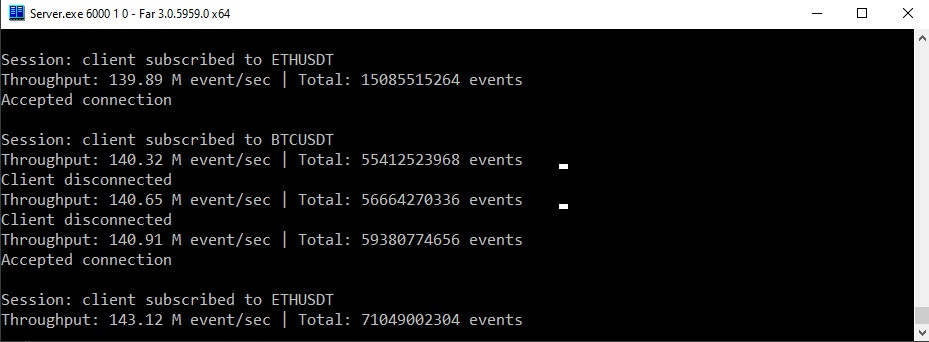
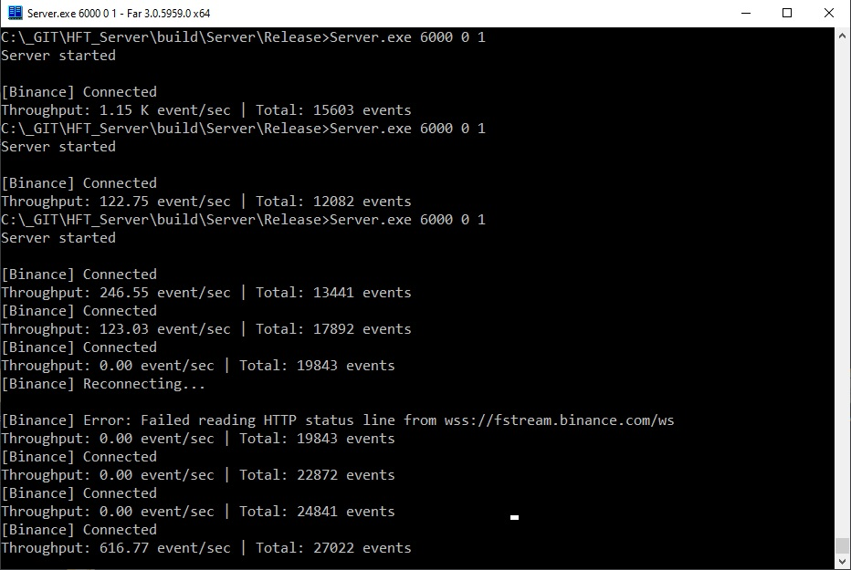
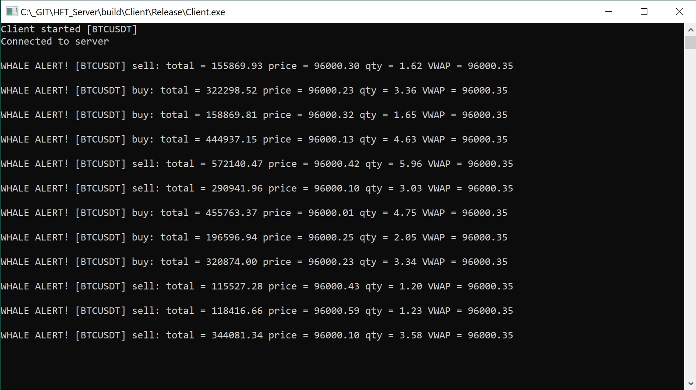
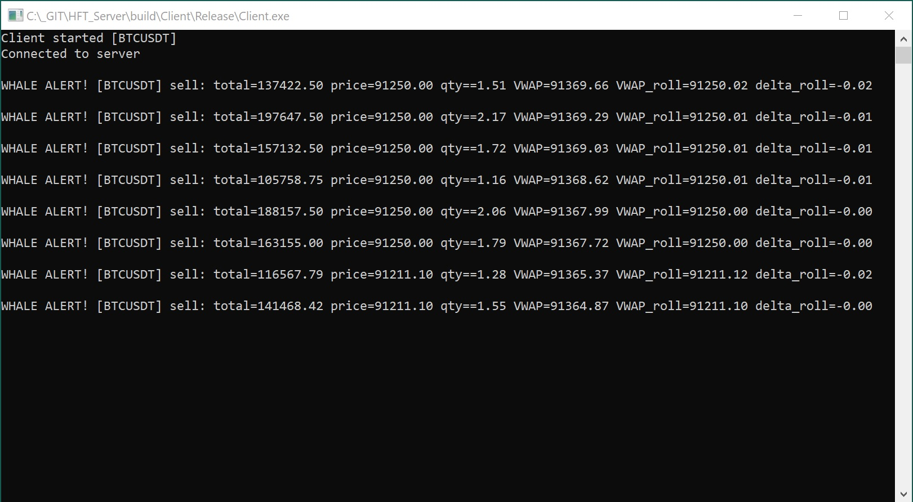

# High-Frequency Market Data Analytics Engine

A high-performance C++ server designed for real-time monitoring and analysis of "whale" trades (large-volume transactions) on cryptocurrency exchanges. The system is engineered for low-latency data processing, utilizing lock-free structures and asynchronous I/O to handle high-throughput market data feeds.
The system performs real-time VWAP calculations and whale detection at 100M+ Events Per Second (EPS).

The engine supports two distinct data sources tailored for different use cases:

* Hi-Speed Emulation Mode: A synthetic market event generator designed for stress testing. It enables the evaluation of system throughput and latency under extreme loads (exceeding 100 million events per second) without being bottlenecked by network bandwidth.

* Production Binance Stream: A direct connection to the Binance WebSocket API. It utilizes the ixwebsocket library for a robust, high-uptime connection and SIMDJson for ultra-fast parsing of incoming JSON packets, significantly minimizing CPU overhead.


## Key Architectural Decisions

1. Low-Latency Architecture: Implements custom lock-free Ring Buffers to pass data between threads without the overhead of mutexes.

2. High-Throughput Processing:

    Hot Dispatcher: Rapidly ingest and pre-process raw market events.
    Zero-Copy Data Pipeline: to handle extreme throughput on consumer-grade hardware (like i7-9700), the system avoids the "Copy-Per-Subscriber" bottleneck.
    Event Dispatcher: Filters trades based on USD volume thresholds and calculates real-time analytics.

3. Advanced Analytics Engine: Calculates multiple versions of the Volume Weighted Average Price (VWAP):

    Session VWAP: Cumulative average since server start.

    Rolling VWAP: Moving average over the last N trades.

4. Optimized Networking: Built on Boost.Asio with thread-safe "strands" to manage thousands of concurrent client sessions.

5. Fast Metadata Lookup: Uses a custom CoinRegistry (a high-speed hash table with open addressing) to map ticker symbols to internal indices in O(1) time.

6. Network Core: Powered by my personal **Client/Server boilerplate** based on Boost.Asio https://github.com/Schwarz77/AsyncTcpSignalServer


## System Architecture

The server operates as a multi-stage pipeline to ensure that network I/O never blocks the analytical engine:

* Producer (Binance/Emulator): Connects to the exchange via WebSockets and pushes raw MarketEvent data into the m_hot_buffer.

* Hot Dispatcher: Consumes raw events, updates the analytical state (VWAP, price updates) in the CoinAnalytics array.

* Event Dispatcher: Identifies "Whale Events" based on volume. If a trade exceeds the threshold, it is moved to the m_event_buffer.

* Client Sessions: Each session runs in its own thread/strand, filtering events based on the client's specific subscriptions (e.g., "Only show me BTC trades > $100k").


## Tech Stack

* Language: C++20

* Networking: Boost.Asio

* JSON Parsing: simdjson (High-performance SIMD-accelerated parsing)

* WebSocket: IXWebSocket

* Data Structures: Custom Lock-free Ring Buffers.


## Build

Prerequisites

* C++20 compatible compiler

* Boost Libraries (System, Asio)

* simdjson

* IXWebSocket

* GoogleTest: Used for unit testing.


## Standard Build Instructions 

First, clone the repository:
```
git clone <repo_url>
cd <repo>
```


### Windows (Using Vcpkg)

Ensure that VCPKG is installed and the environment variable `%VCPKG_ROOT%` is correctly set.
```
mkdir build && cd build
cmake .. -DCMAKE_TOOLCHAIN_FILE=%VCPKG_ROOT%/scripts/buildsystems/vcpkg.cmake -DCMAKE_BUILD_TYPE=Release
cmake --build . --config Release
```


## Running

### Server

Start the server, listening on port 5000:
```
./bin/Server 5000		

or

# 				port		emulator/binance_stream		VWAP_roll
./bin/Server 	5000 		0 							1   

```

### Client

Start the client and connect to the server at 127.0.0.1:5000:
```
./bin/Client 127.0.0.1 5000

or

# 				IP 			port 	req_type 	coin_name 	whale_treshold 	VWAP_roll 
./bin/Client 	127.0.0.1 	5000 	1 			ETHUSDT 	150000 			0	
```


## Benchmark

Environment: Windows 10/11 | Intel Core i7-9700 @ 3.00GHz | 16GB RAM | Compiled with MSVC (AVX2 enabled)

|Throughput (EPS) | Configuration |	Complexity | Why the difference?	
| :--- | :--- | :--- | :--- |
| 141M | 4 Coins (Fixed Array) | VWAP_session |	Maximum Optimization: Compiler uses constant folding and direct memory addressing.
| 117M | 4 Coins (Fixed Array) | VWAP_session + VWAP_roll |	Maximum Optimization. Computational Weight: Managing rolling windows (sliding buckets) increases the number of memory writes per event.
| 129M | 4 Coins (Runtime Vector) | VWAP_session | Computational Weight: Managing rolling windows (sliding buckets) increases the number of memory writes per event.
| 116M | 4 Coins (Runtime Vector) | VWAP_session + VWAP_roll| Computational Weight: Managing rolling windows (sliding buckets) increases the number of memory writes per event.
| 126M | 1024 Coins (Runtime Vector) | VWAP_session | Computational Weight: Managing rolling windows (sliding buckets) increases the number of memory writes per event.
| 90M | 1024 Coins (Runtime Vector) | VWAP_session + VWAP_roll| O(1) Scalability: Performance remains high even with 1024 coins, proving that the dispatcher logic is independent of the number of instruments.


## Directory Structure
```
├── CMakeLists.txt 
├── Server/
│   ├── CMakeLists.txt 
│   ├── Session.h
│   ├── Session.cpp
│   ├── Server.h
│   ├── Server.cpp
│   ├── RingBuffer.h
│   ├── Analytics.h
│   ├── CoinRegistry.h
│   └── main.cpp
├── Client/
│   ├── CMakeLists.txt 
│   ├── Client.h
│   ├── Client.cpp
│   └── main.cpp
├── Include/
│   └── Protocol.h
├── Utils/
│   ├── Utils.h
│   └── Utils.cpp
├── Tests/
│   ├── CMakeLists.txt 
│   ├── RingBufferTest.cpp
│   └── AnalyticsTest.cpp
└──build/
```


# Examples of use







## License

This project is licensed under the **MIT License**.	

